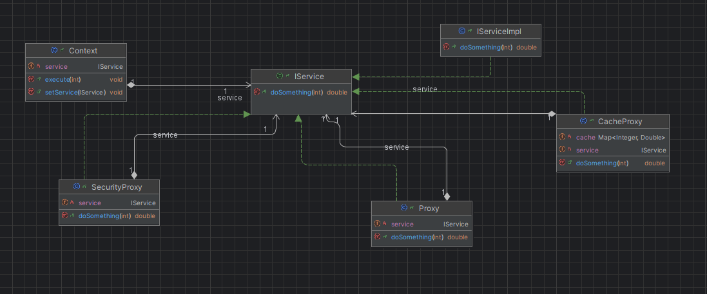

# Design Pattern Proxy

## Contexte
Le pattern Proxy est un design pattern structurel qui fournit un substitut ou
un intermédiaire à un autre objet pour contrôler l'accès à celui-ci. 
Ce modèle est souvent utilisé pour ajouter des fonctionnalités telles que le contrôle d'accès, 
le cache ou la journalisation sans modifier la classe originale.

---  

## Diagrammes de Classe

## Conclusion
Le design pattern Proxy permet d'intercaler une couche supplémentaire entre un client et
un service sans modifier la classe originale. Ce modèle est particulièrement utile pour des 
cas d'utilisation comme la gestion du cache, le contrôle d'accès et la journalisation.
